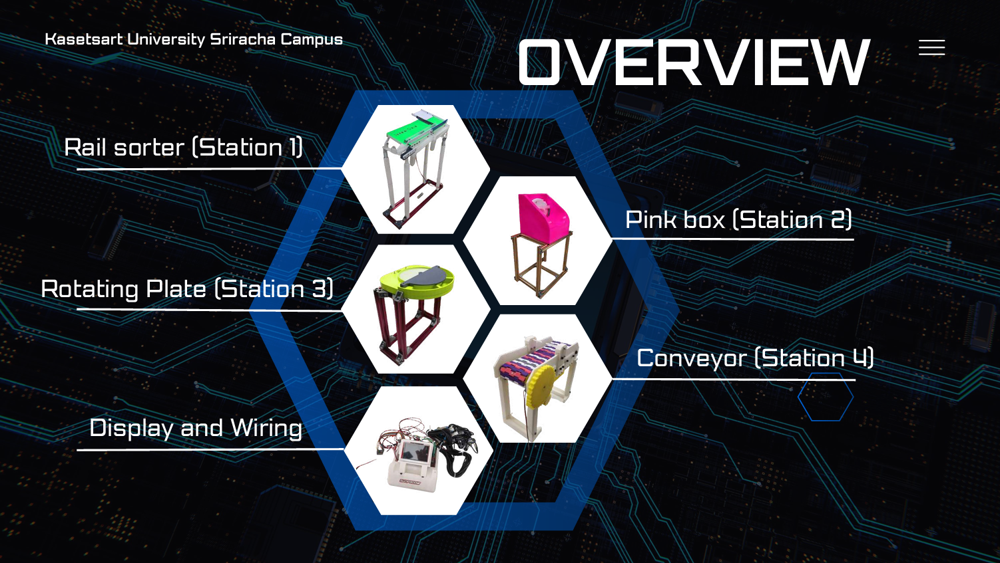
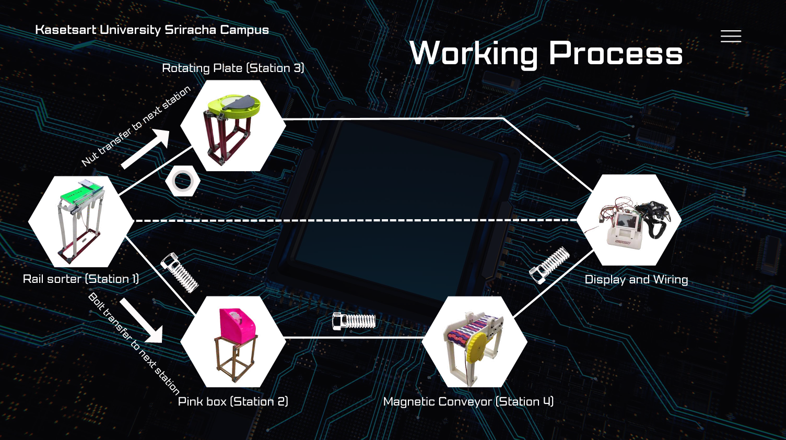
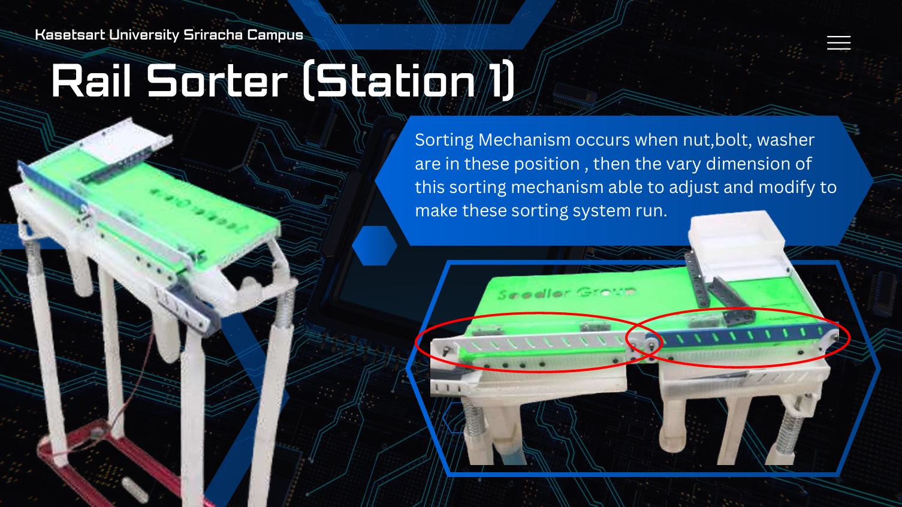
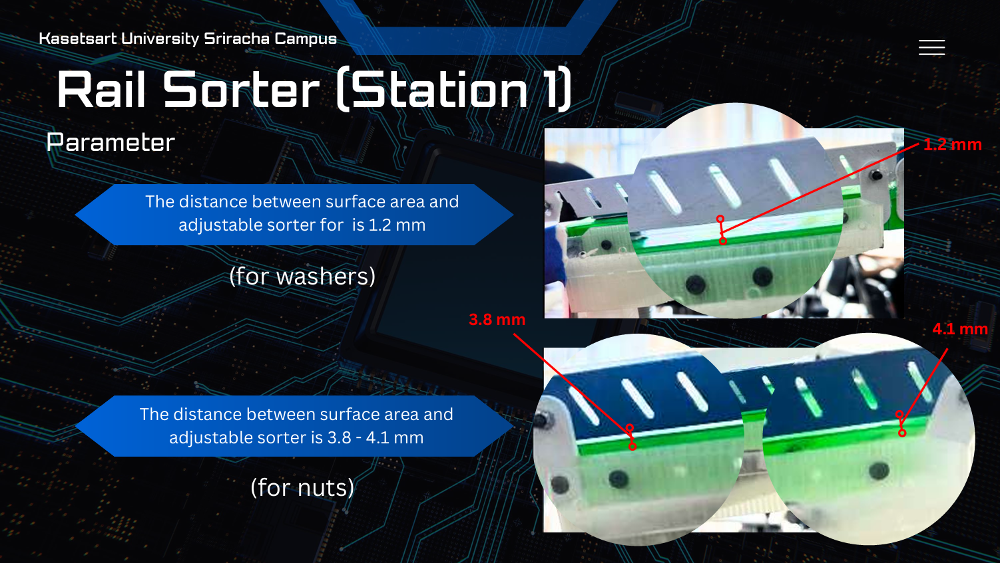
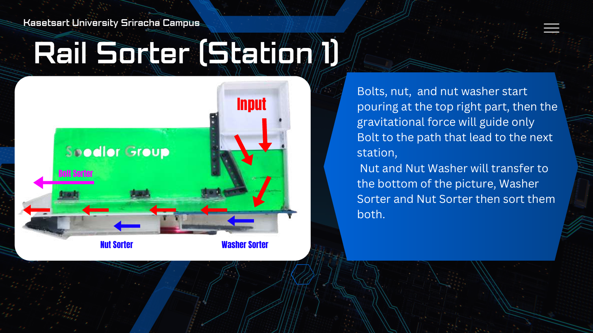
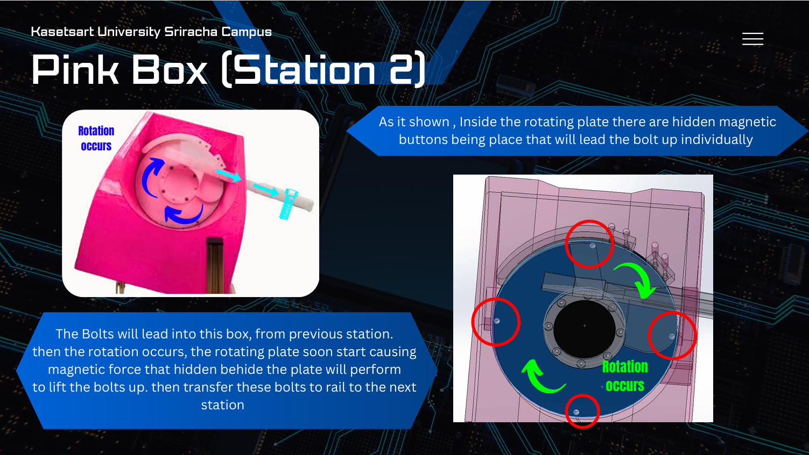
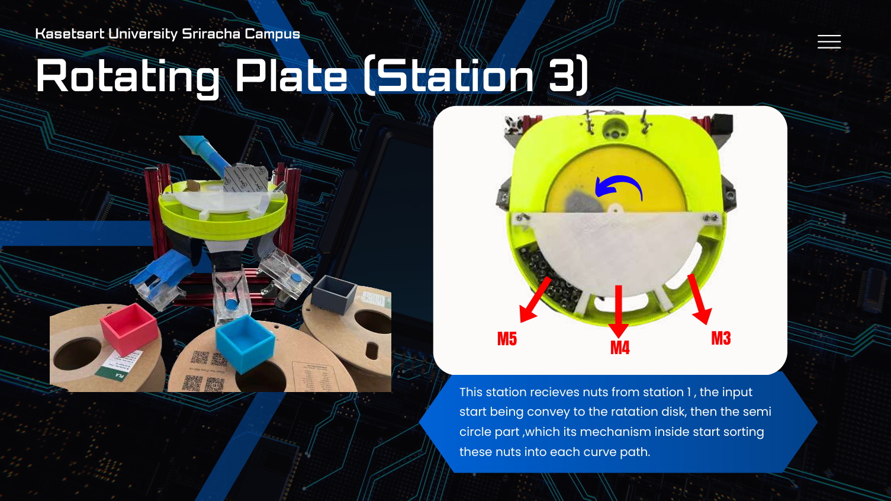
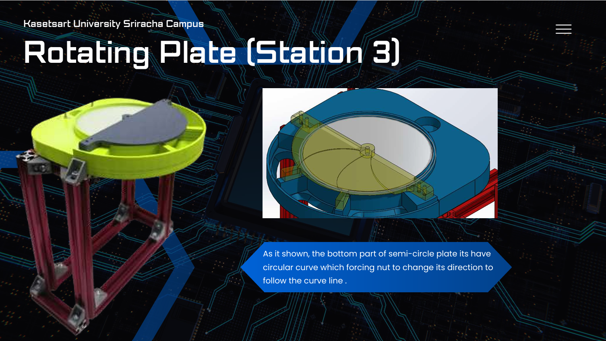
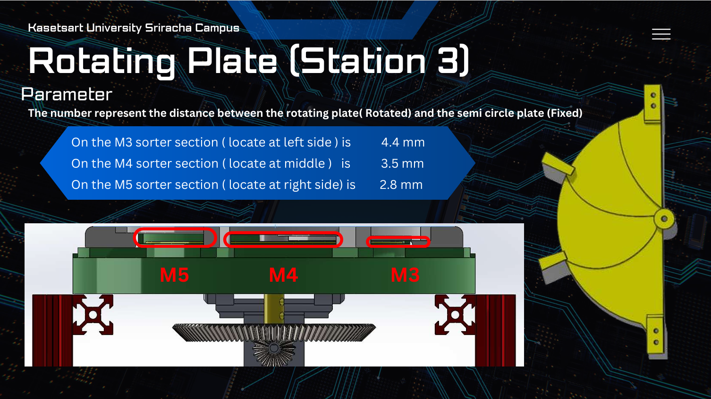
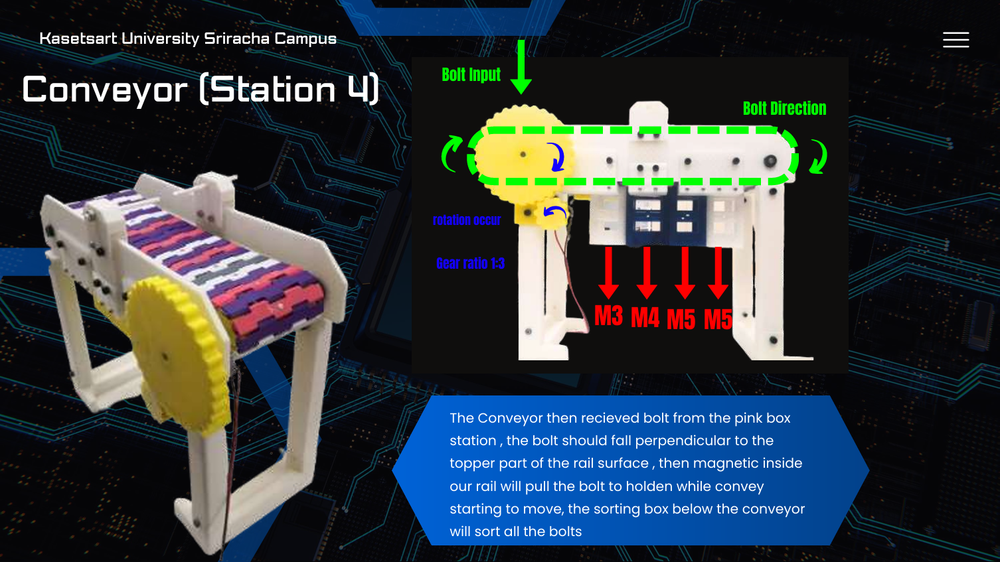

# NBN Sorter - Automated Bolt, Nut \& Washer Sorting Machine

> A mechatronics project by students of \*\*Kasetsart University Sriracha Campus\*\*  
> Industrial Engineering Program

## Project Overview

NBN Sorter is an automated mechanical sorting machine designed to separate mixed hardware fasteners — **bolts, nuts, and washers** — by type and size (M3, M4, M5) without human intervention.

The system uses a combination of gravity-based rail sorting, magnetic conveyance, rotating disk mechanisms, and a real-time TFT dashboard to classify and count each fastener type.

**Input:** Mixed bolts (M3/M4/M5), nuts, and washers poured into the input hopper  
**Output:** Sorted fasteners separated into individual collection bins by size and type

## System Architecture 

The machine consists of **4 stations** connected in sequence, plus a display/wiring unit:

## Station Details
## Station 1 - Rail Sorter

* Mixed fasteners are poured at the top-right input hopper
* Gravity guides bolts along one path to Station 2
* Nuts and washers slide down to separate sorter rails
* An adjustable gap mechanism separates by thickness:

  * **1.2 mm** gap → washers pass through
  * **3.8–4.1 mm** gap → nuts pass through
* An acrylic cover guide prevents parts from bouncing off due to motor vibration
* Spring-loaded coupling increases incline force to prevent jamming

**Accuracy: 85%** (255/300 over 10 test runs)

## Station 2 - Pink Box (Bolt Feeder)

* Receives bolts from Station 1
* Internal rotating disk with **hidden magnetic buttons** picks up bolts individually
* Bolts are lifted and guided along a rail to Station 4
* Magnetic hole offset: **2.0 mm** (optimal for single-bolt pick-up)
* Guide rail incline was increased to reduce friction-related jamming

**Accuracy: 39%** (39/100 over 10 test runs) — *lowest performing station; main bottleneck*

## Station 3 - Rotating Plate (Nut Sorter)

* Receives nuts from Station 1
* A rotating disk with a fixed semi-circle plate directs nuts into size-based curve paths
* Sorting gap parameters (distance between rotating plate and fixed semi-circle):

  * **M3** section: 4.4 mm
  * **M4** section: 3.5 mm
  * **M5** section: 2.8 mm
* Drive system: bevel gear reduction at **1:4.5 ratio** (replaced original belt-pulley drive)
* Front support added to the semi-circle plate for perpendicular stability

**Accuracy: 97.6%** (117/120 over 10 test runs) — *best performing station*

## Station 4 - Magnetic Conveyor (Bolt Sorter)

* Receives bolts from Station 2
* Bolts attach to magnets embedded in the conveyor rail surface
* As the belt moves, bolts drop into M3/M4/M5 collection boxes below
* Wall thickness between bolt and magnet: **1.5 mm offset** (optimal release force)
* Gear ratio: **1:3**
* Conveyor belt uses custom-designed **PLA linkage** (replaced thin metal wire)
* Rail designed from scratch in SolidWorks with embedded magnet holes

**Accuracy: 64%** (64/100 over 10 test runs)

## Display \& Wiring — NBN Dashboard

* Built on **ESP32** with **TFT eSPI** display
* GUI rendered using **LVGL** library
* Displays real-time count of sorted bolts (M3/M4/M5) and nuts/washers
* Serial communication with sensors via **circular buffer**
* Dynamic label updates via `updateUI()` function based on `sensorOut\[]` array

## Overall Results

|Station|Component|Accuracy|
|-|-|-|
|Station 1|Rail Sorter|85%|
|Station 2|Pink Box|39%|
|Station 3|Rotating Plate|**97.6%**|
|Station 4|Magnetic Conveyor|64%|
|**Overall System**|End-to-end (3 runs)|**40.95%**|

### 

## End-to-End Test Summary (3 runs)

|Size|Bolt|Nut|Washer|
|-|-|-|-|
|M3|26.6%|40%|—|
|M4|3.3%|40%|—|
|M5|10%|80%|—|
|OTHER|—|—|90%|
|**Category Total**|**35.71%**|**30%**|**57.14%**|

> Overall system accuracy: \*\*40.95%\*\*

## Known Issues

* **Station 2 (Pink Box)** is the primary bottleneck — magnetic clumping causes multiple bolts to jam together
* **Washer sensor** reads 0% — washers could not be detected reliably in the dashboard
* **Bolt detection** in the dashboard is slow and error-prone
* PLA deformation requires manual filing with vernier caliper to maintain tolerances
* End-to-end accuracy is limited by inter-station transfer reliability

## Design Iterations

The machine went through **6 design versions** before reaching the final build, iterating on:

* Structural layout and station arrangement
* Drive systems (belt-pulley → bevel gear reduction)
* Conveyor belt material (metal wire → PLA linkage)
* Sorting gap dimensions (empirically tested)

## Team Member

* Chanaprachpakorn Ngernmo
* Theerapol Guanmuangtai
* Thanakrit Wongkha
* Warut Tongrung
* Norawich Lorttrakanont
* Kunasin Laysak
* Danuphat Parnpradit
* Thanakon Chaichana
* Jerich Brylle Sison
* Sajakorn Chutikarnmongkol

## Institution

**Kasetsart University Sriracha Campus**  
Industrial Engineering Program

*This project was developed as part of an academic engineering design course.*
**Full Demonstration Video**: 🔗 **[Watch on YouTube](https://youtu.be/BTTlB-tEGTM?si=GIfPtlQIp4Oagcnz)**
